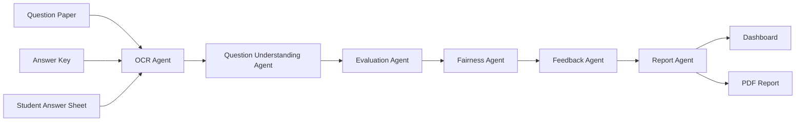
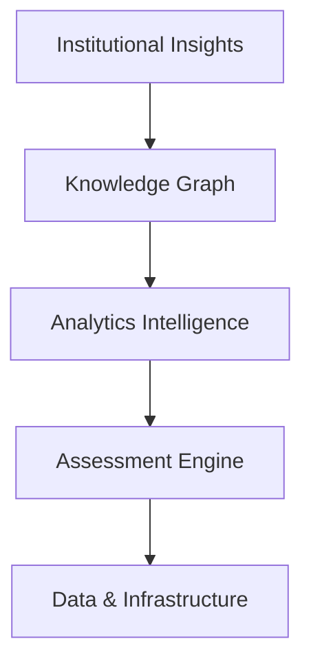
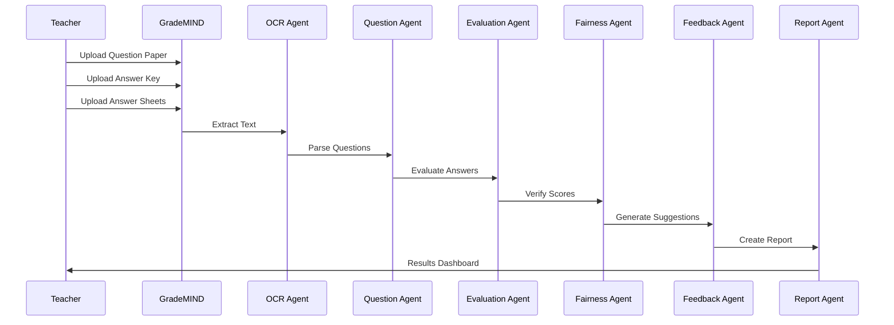

<div align="center">

# 🧠 GradeMIND

### Transforming Examination Evaluation with Autonomous AI Agents


<br>


<br>


</div>

---

# 🚀 Overview

GradeMIND is an AI-powered Assessment Intelligence Platform that automates answer sheet evaluation using a swarm of specialized AI agents.

Traditional evaluation systems suffer from:

- ⏳ Long correction times
- ⚖️ Grading inconsistencies
- 📝 Limited feedback
- 📊 Lack of learning analytics

GradeMIND solves this through a Multi-Agent AI Pipeline capable of evaluating answer sheets in minutes while generating transparent scoring explanations and actionable student feedback.

---

# 🎯 Problem Statement

Teachers spend hours evaluating answer sheets manually.

For a class of 120 students:

- 20 minutes per sheet
- 40+ hours of correction
- Increased fatigue
- Grading bias
- Delayed results

GradeMIND reduces this workload by over **80%** while improving consistency and feedback quality.

---

# ✨ Key Features

## 🤖 AI Evaluation Engine

- Semantic Answer Evaluation
- Partial Credit Allocation
- Concept-Level Scoring
- Explainable Mark Distribution
- Confidence Scores

## 📄 OCR Processing

- EasyOCR Integration
- Tesseract OCR
- Handwritten Answer Support
- Printed Answer Support

## 📊 Analytics Dashboard

- Class Performance Analysis
- Concept Mastery Heatmaps
- Weak Topic Detection
- Performance Trends

## 🧠 Explainable AI

- Why marks were awarded
- Missing concepts identified
- Evidence extraction
- Rubric-based evaluation

## 🔐 Security

- JWT Authentication
- Role-Based Access Control
- Secure File Upload
- Audit Logs

---

# 🏗️ Architecture



---

# 🧠 GradeMIND Intelligence Stack



---

# ⚙️ Tech Stack

| Layer | Technology |
|---------|------------|
| Frontend | Next.js 14 |
| Styling | TailwindCSS |
| Backend | FastAPI |
| Database | PostgreSQL |
| Storage | Supabase |
| OCR | EasyOCR + Tesseract |
| AI Models | Groq Llama 3 |
| Deployment | Vercel + Render |

---

# 🔄 Evaluation Workflow



---

# 📂 Project Structure

```bash
GradeMIND
│
├── frontend/
│   ├── app/
│   ├── components/
│   ├── hooks/
│   └── lib/
│
├── backend/
│   ├── api/
│   ├── models/
│   ├── services/
│   ├── agents/
│   ├── database/
│   └── core/
│
├── docs/
│
└── README.md
```

---

# 🧩 Multi-Agent System

| Agent | Responsibility |
|---------|---------------|
| OCR Agent | Extract Answer Text |
| Question Understanding Agent | Concept Mapping |
| Evaluation Agent | Score Generation |
| Fairness Agent | Bias Verification |
| Feedback Agent | Personalized Suggestions |
| Report Agent | Reports & Analytics |

---

# 📈 Expected Impact

| Metric | Traditional | GradeMIND |
|----------|------------|------------|
| Evaluation Time | 2–5 Days | <5 Minutes |
| Teacher Effort | 40–80 Hours | <2 Hours |
| Consistency | 65% | 95%+ |
| Feedback | Generic | Personalized |
| Scalability | Limited | Unlimited |

---

# 👥 Team Phoenix

### 🧑‍💻 Shreekumar B
Product Architect • Team Lead • Full Stack

### 🛠️ Nakshatra
Backend Engineer • FastAPI • Database Design

### 🎨 Meenakshi
Frontend Engineer • UX Design • Analytics UI

### 🤖 Vishwanath
AI/ML Engineer • OCR • Evaluation Engine

---

# 🚀 Local Setup

## Clone Repository

```bash
git clone https://github.com/bsrikumar855-dot/GradeMIND.git
```

## Frontend

```bash
cd frontend

npm install

npm run dev
```

## Backend

```bash
cd backend

pip install -r requirements.txt

uvicorn app.main:app --reload
```

---

# 🎥 Demo

Coming Soon...

---

# 🛣️ Roadmap

### MVP
- [x] Architecture Design
- [x] Database Design
- [x] AI Evaluation Pipeline
- [ ] Frontend Dashboard
- [ ] End-to-End Integration

### v1.1
- Human-in-the-Loop Review
- Rubric Builder

### v2.0
- Knowledge Graph
- Integrity Detection
- Institutional Analytics

### v3.0
- Multi-Language Evaluation
- Diagram Assessment
- Mathematical Expression Scoring

---

# ⭐ Vision

> "Every student deserves expert feedback. GradeMIND makes that possible."

GradeMIND is building the future infrastructure layer for educational assessment.

---

<div align="center">

### 🌟 Redefining How Education Evaluates Learning

⭐ Star this repository if you support AI-powered education.

</div>
