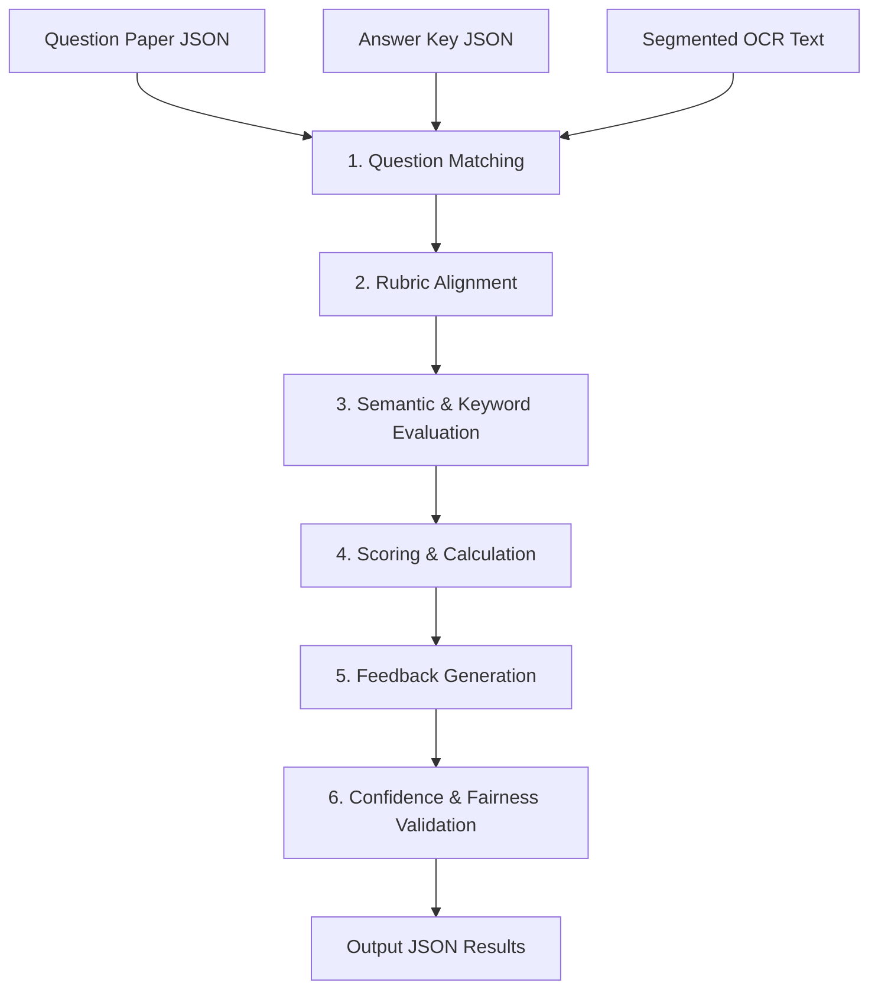

# GradeMIND AI Evaluation Engine

This document outlines the architecture, pipeline, and methodology of the AI evaluation engine that grades handwritten answers against reference keys.

---

## Evaluation Workflow

The evaluation engine takes segmented OCR text and grades it against the question paper context and marking guidelines.

---

## Processing Steps

### 1. Question Matching
Aligns each segmented student answer block with its corresponding question text and answer key. It uses regex and vector search to map labeled answers (e.g. "Ans 1(b)") to reference keys.

### 2. Rubric Alignment
Maps the grading criteria to steps. For instance:
- State formula: 2 marks.
- Correct calculation: 2 marks.
- Correct units: 1 mark.

### 3. Semantic & Keyword Evaluation
Combines semantic similarity (contextual embeddings) with lexical overlap (keyword matching) to check if the student expressed the correct concept, regardless of their wording.

### 4. Scoring & Calculation
Calculates the final score for the question by summing the marks awarded for each rubric criteria. It ensures the score does not exceed the question's maximum allowed marks.

### 5. Feedback Generation
Drafts constructive feedback detailing why marks were awarded or deducted, citing the exact grading criteria that were or were not met.

### 6. Confidence & Fairness Validation
- **Confidence Score**: Combines OCR confidence with grading confidence and applies penalties for detected discrepancies. Scores below `0.70` flag the submission for teacher review.
- **Anonymization**: Submissions are anonymized (student IDs and names are removed) before evaluation to prevent grading bias.

---

## LLM Usage: Optional, Not Required

**Grading does not require an LLM or any API key.** The primary evaluation pipeline
(`AI/evaluation/rubric_engine.py`, `concept_engine.py`, `semantic_engine.py`,
`autonomous_evaluator.py`, `scorer.py`, `feedback.py`, `fairness.py`) is entirely
local: rule-based rubric matching, keyword/lemmatization checks, and local
sentence-embedding similarity. It runs fully offline and produces the score that
is actually awarded.

**Gemini is an optional secondary cross-check**, provided by
`AI/evaluation/gemini_evaluator.py`. When `GEMINI_API_KEY` is set, it independently
re-scores the same answer and `AI/evaluation/verification_engine.py` compares its
score against the primary score to flag disagreements for manual review. It never
modifies `score_awarded`, `confidence`, or marks — it is purely informational. If
`GEMINI_API_KEY` is absent (or the API call fails), the evaluator logs a warning and
returns `None`; the rest of the pipeline proceeds unaffected.

This is the only LLM integration point in the codebase. There is no other provider
(e.g. Groq) wired into any evaluation code, regardless of what older docs may say.

---

## Evaluation Methodologies

### Rubric Evaluation
A rule-based evaluation that grades responses step-by-step, matching the student's
answer against each rubric criterion locally.

### Keyword Evaluation
Checks for critical terms (e.g., "chloroplast", "mitosis", "photosynthesis") required by the answer key. This is done using exact matching and lemmatization (word normalizations).

### Semantic Evaluation
Uses local contextual sentence embeddings to evaluate conceptual understanding. If a student uses a synonym or alternative explanation (e.g., "cellular powerhouse" instead of "source of cell energy"), the engine recognizes it as correct. This does not call an external LLM.

### Gemini Cross-Check (Optional)
When configured, provides a second, independent score and reasoning for comparison
against the primary evaluation. See "LLM Usage" above.

---

## Fairness Layer

The Fairness Layer is implemented as local, deterministic checks (`AI/evaluation/fairness.py`) to ensure objective grading:
1. **Name Anonymization**: Flags student identifier details (emails, names, roll numbers) detected in extracted text.
2. **Neatness Neutrality**: Flags feedback that references handwriting style, formatting irregularities, or neatness.
3. **No Halos**: Each question is graded independently to prevent grading bias from previous answers.
4. **Adherence to Rubric**: Scores are verified to never exceed the rubric's allocated marks and to match the sum of matched criteria.
