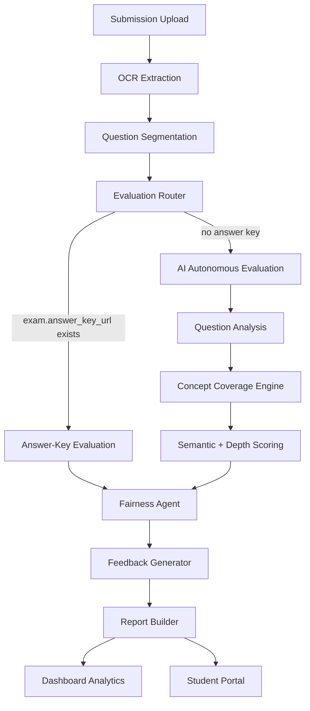

# GradeMIND Phase 7 - Autonomous AI Evaluation Engine

## Gap Analysis

| Phase 7 Requirement | Current State Before Phase 7 | Implementation Status |
| --- | --- | --- |
| Answer keys optional | `answer_key_url` existed but evaluation failed without it | Implemented: missing answer key routes to `AI_AUTONOMOUS` |
| `evaluation_mode` on exams | Missing | Implemented model field and Alembic migration |
| Answer-key assisted mode | Existing rubric workflow was present | Preserved as `ANSWER_KEY` mode |
| Autonomous evaluator | Missing | Added `AI/evaluation/autonomous_evaluator.py` |
| Question understanding | Heuristic agent existed | Reused and extended autonomous analysis for type, difficulty, depth |
| Concept coverage engine | Missing | Added `AI/evaluation/concept_engine.py` |
| Autonomous scoring prompt | Missing | Added prompt templates in `AI/evaluation/prompts.py` |
| Fairness filtering | Partial fairness checks existed after scoring | Added pre-evaluation sanitization for identity/protected terms |
| Confidence formula | Existing OCR/grading confidence existed | Added autonomous `(semantic + coverage + alignment) / 3` question confidence |
| Evaluation output updates | Mode/coverage absent | Added `evaluation_mode`, `concept_coverage`, `study_recommendations` |
| Dashboard analytics | Existing metrics only | Added autonomous vs answer-key evaluation counts |
| Student feedback | Strengths/weaknesses/improvements existed | Added study recommendations and concept coverage fields |
| Report updates | Existing PDF/JSON report builder | Extended with mode, concept coverage, study recommendations |
| Test suite | Missing autonomous tests | Added `AI/tests/test_autonomous_evaluator.py` |
| Backward compatibility | Existing APIs needed preservation | Existing routes and response fields are preserved; new fields are additive |

## Architecture



## Evaluation Routing

```python
if exam.answer_key_url:
    evaluate_with_answer_key()
else:
    evaluate_autonomously()
```

## API Compatibility

Existing endpoints remain unchanged:

- `POST /exams`
- `GET /exams`
- `POST /submissions/upload`
- `GET /submissions/{id}/report`
- `GET /submissions/{id}/pdf`
- Dashboard and student portal result endpoints

New fields are additive:

- `evaluation_mode`
- `concept_coverage`
- `study_recommendations`
- Dashboard `autonomous_evaluations`
- Dashboard `answer_key_evaluations`

## Production Readiness Assessment

The autonomous evaluator is deterministic, local, and does not fabricate OCR or marks. It fails explicitly when question context is missing. For high-stakes production use, an external LLM or embeddings provider can be added behind the prompt contracts, but the current implementation is suitable for demo and project submission workflows where answer keys are optional.
